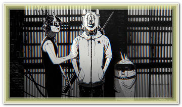
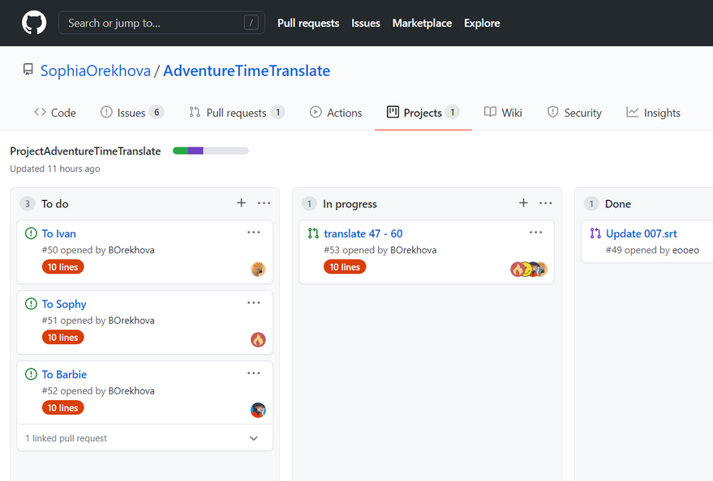
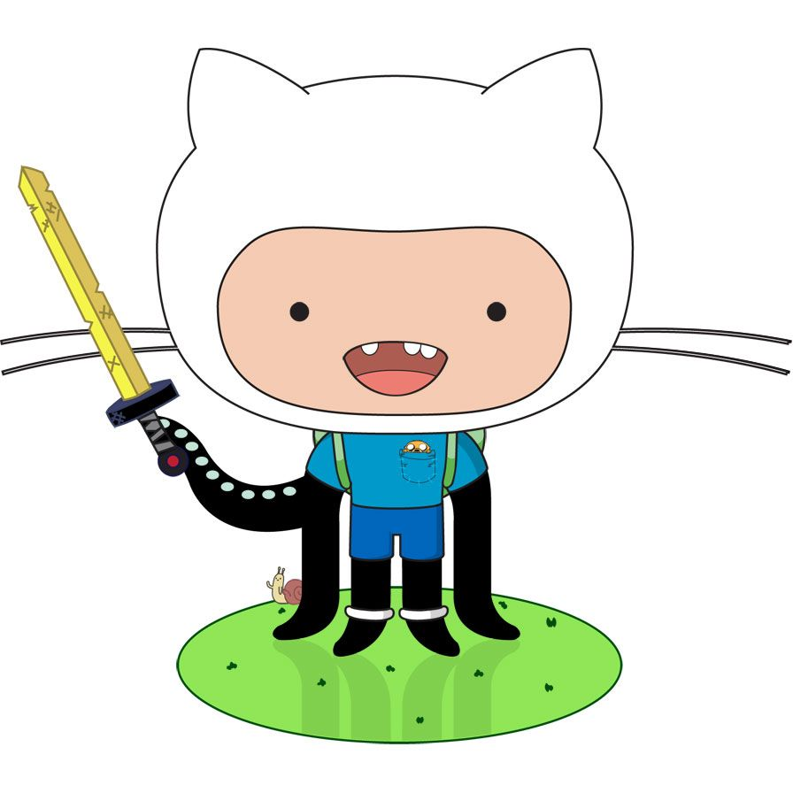

# AdventureTimeTranslate 
road map  

1. ## create project
>1.1 - **TEMPLATE** - `automated canban`  
>1.2 - **CLEAN** - `archive all card`  
>1.3 - **CREATE ISSUE** - `add new note` - `convert to issue`  
>_note:_  
>_create seven issue for a week every sunday_    
2. ## translate text   
>2.1 `1 hour`  
>2.2 _before commit check_ - `create new brunch`  
>2.2.1 _rename_ - `date, number of line`  
>.  
>.  
>.  
>create pull request  
>  

they're our links  

[there's a wiki, welcome!](https://github.com/SophiaOrekhova/AdventureTimeTranslate/wiki)

</img>

[there's a project, welcome!](https://github.com/SophiaOrekhova/AdventureTimeTranslate/projects/2)

</img>  

they're issues  

